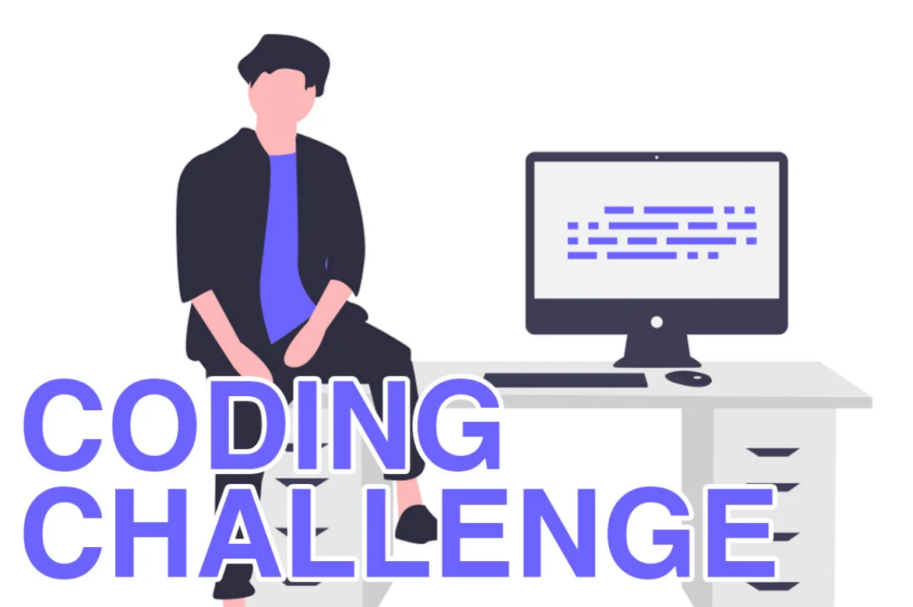
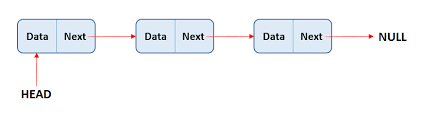

<a name="readme-top"></a>
<div align="center">
  <h1>DSA WEEKLY PRESENTATION</h1>
</div>

# 📗 Table of Contents

- [Next week Challenge](#next-meeting-exercise)
- [Next Week DSA topic](#next-week-presentation)
- [Week-3 Activity And Discussion](#week---3-info)
  - [what we did](#what-we-did)
  - [what we discuss](#what-we-discuss)
  - [Challenge of this week](#challenge-of-the-week)
- [Week-2 Activity And Discussion](#week---2-info)
  - [what we did](#what-we-did)
  - [what we discuss](#what-we-discuss)
  - [Challenge of this week](#challenge-of-the-week)
- [Week-1 Activity And Discussion](#week---1-info)
  - [What we did](#what-we-did-1)
  - [what we discuss](#what-we-discuss-1)
  - [Challenge of this week](#challenge-of-the-week)
- [Week-0 Activity](#week---0-info)

<br>

# NEXT MEETING Exercise
  > We have already discuss linkedlist so we have to improved it 
  - [ ] add more relevant functions
  - [ ] improve our functions

  # NEXT WEEK PRESENTATION 

  ## A presentation with coding challenge 
  <br>

  <div align=center>
    
  </div>
  <!-- <div align=center>
    
  </div> -->
  <hr>
  <br>

  - [ ] We will use shorting hat function of this file <a href="https://github.com/PowerLevel9000/dsa-presentation/blob/main/shorting-hat.js">visit me</a> to decide our presenter 
    - presenter have to share screen if he is comfortable and discuss the activity below
    - presenter receive constructive feedback of the meeting 
    - presenter will ask if someone want to add something in code base 
  - [ ] We will solve 2 - 3 good coding challenge related to `linked list`, `queue`, `stack`

<br><hr>
<p align="right">(<a href="#readme-top">back to top</a>)</p>

  ## week - 3 info
  <div align=center>
    
  </div>

  ### what we did
  - date `2020-04-30` and we discuses about `Linked List` 
    - we create LinkedList & Node class with various Linked List function such as 
      - insert
      - atIndex
      - nodeAtIndex
      - insertAtIndex
      - print
      - removeAtIndex
      - etc 
      - we discussed at base level of everything

  <p align="right">(<a href="#readme-top">back to top</a>)</p>

  ### what we discuss
  - we discussed last week challenges
  - files
    - <a href="https://github.com/PowerLevel9000/dsa-presentation/blob/main/link-list-week-3/linkedlist.js">`linkedlist.js`</a> And improved and discussed
    <a href="https://github.com/PowerLevel9000/dsa-presentation/blob/main/stack-week-1/stack.js">`stack`</a>
    <a href="https://github.com/PowerLevel9000/dsa-presentation/blob/main/queue-week-2/queue.js">`Queue`</a>

  <p align="right">(<a href="#readme-top">back to top</a>)</p>

  ## week - 2 info
  <div align=center>
    
  </div>

  ### what we did
  - date `2020-04-16` and we discuses about `QUEUE` 
    - we create Queue class with various Queue function such as 
      -  insert
      -  delete 
      -  isEmpty
      -  clear
      -  etc 
  
  <p align="right">(<a href="#readme-top">back to top</a>)</p>

  ### what we discuss
  - we discussed last week challenges
  - files
    - <a href="https://github.com/PowerLevel9000/dsa-presentation/blob/main/queue-week-2/queue.js">`queue.js`</a> And <a href="https://github.com/PowerLevel9000/dsa-presentation/blob/main/stack-week-1/stack.js">`improved and discussed in this file`</a>

  <p align="right">(<a href="#readme-top">back to top</a>)</p>

  ## Challenge of the Week
  revise everything with coding challenge like stack and queue 

  <p align="right">(<a href="#readme-top">back to top</a>)</p>

  ## week - 1 info
  <div align=center>
    
  </div>

  ### what we did 
  - date `2020-04-09` and we discuses about `Stack` 
    - we create stack class with various stack function such as 
      -  push
      -  pop
      -  isEmpty
      -  clear
      -  last removed
      -  etc 

  <p align="right">(<a href="#readme-top">back to top</a>)</p>

  ### what we discuss
  - we make our shorting hat function and ask for improvement for edge cases
  - files
    - <a href="https://github.com/PowerLevel9000/dsa-presentation/blob/main/stack-week-1/stack.js">`stack.js`</a> And <a href="https://github.com/PowerLevel9000/dsa-presentation/blob/main/shorting-hat.js">`shorting-hat.js`</a>

  <p align="right">(<a href="#readme-top">back to top</a>)</p>

### challenge of the week
- [ ] Improve Shorting hat Function For edge cases <a href="https://github.com/PowerLevel9000/dsa-presentation/blob/d6ee372ea4222fdb136a02877c597083f126613c/shorting-hat.js#L1">Click here</a>
  - For person with `third name` 
  - Two person with the same `First name` 
- [ ] Improve <a href="">`stack.js`</a> from week-2 
  - <a href="https://github.com/PowerLevel9000/dsa-presentation/blob/d6ee372ea4222fdb136a02877c597083f126613c/shorting-hat.js#L1">LastRemove</a> function is not Working. it should return the last pop element since we just mutate `count` it should be easy and it should return `you have nothing in stack` or `your stack is cleared` when stack is cleared . <b>Note here stack empty and stack cleared is two different things</b>  
  - ADD some more function like 2nd last removed 
  - a function which return last pop element whenever it called like
  ```
  const stack = [a,b,c,d,e,f,g,h]
  stack.pop() // removes h
  stack.pop() // removes g
  stack.pop() // removes f
  stack.pop() // removes e
  stack.pop() // removes d
  // our new function name could be anything you want for
  //instance reverter
  stack.reverter() // should return d
  stack.reverter() // now it  should return e
  stack.reverter() // now it  should return f
  stack.reverter() // now it  should return g
  stack.reverter() // lastly it  should return h
  stack.reverter() // lastly it  should return "no more removed items"

  ```

<br><hr>

<p align="right">(<a href="#readme-top">back to top</a>)</p>

## week - 0 info
  
  - date `2022-04-02` and we discuses about time complexity
  - no coding just intro and some fun stuffs

<br><hr>

<p align="right">(<a href="#readme-top">back to top</a>)</p>
# Happy Coding

<div align=center>
   
</div>
<p align="right">(<a href="#readme-top">back to top</a>)</p>
